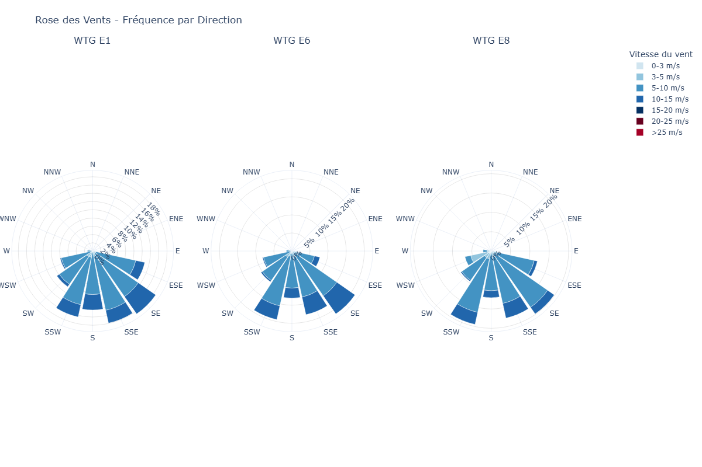
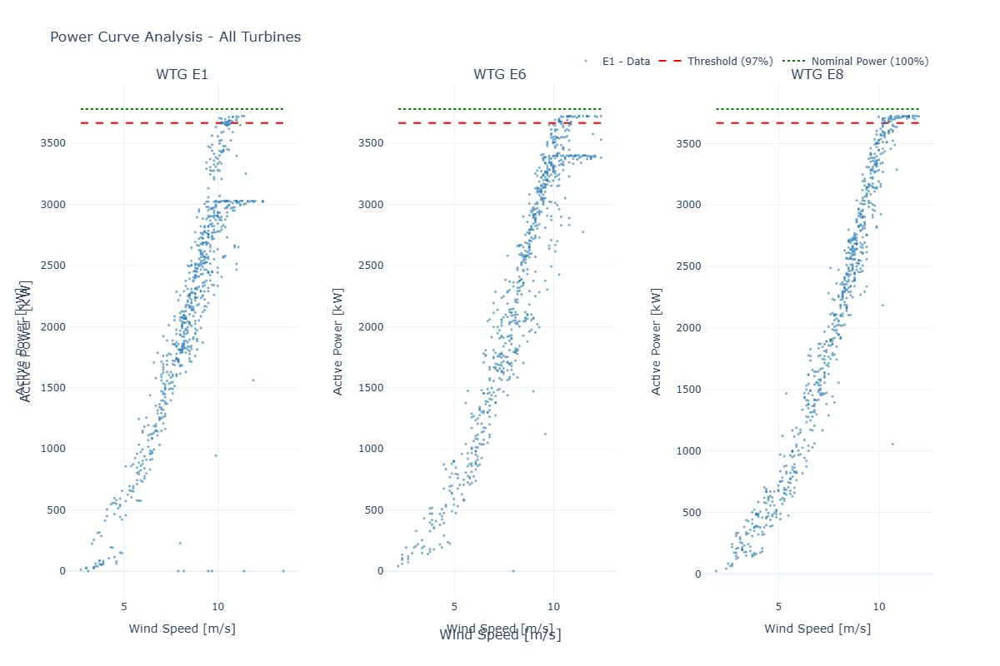
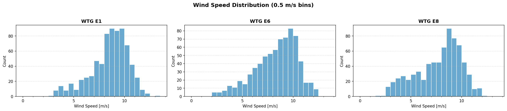
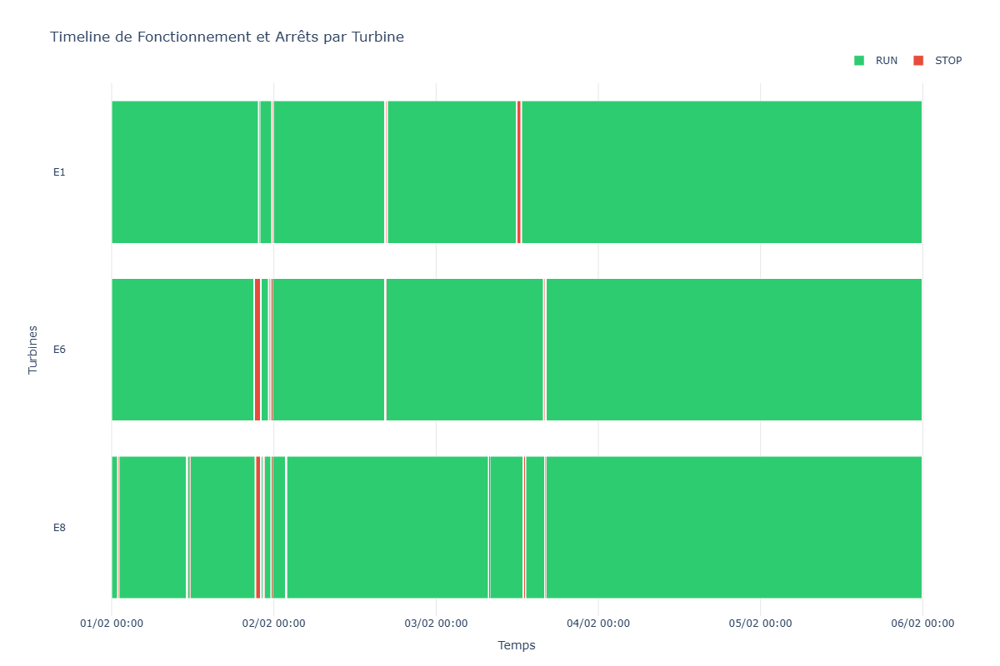

# Wind Turbine Analytics 🌬️

**Système d'analyse de performance et conformité pour parcs éoliens**

Génère automatiquement des rapports Word professionnels à partir de données SCADA et logs d'alarme pour deux types d'analyses : **RunTest** (réception d'éoliennes) et **SCADA** (analyse de performance).

---

## 🎯 Deux Axes d'Analyse

### 1️⃣ RunTest - Validation de Mise en Service

Vérifie la conformité des éoliennes lors de la réception selon 5 critères obligatoires :

- ✅ **Heures consécutives** : ≥120h de fonctionnement ininterrompu
- ✅ **Cut-in/Cut-out** : ≥72h dans la plage de vent opérationnelle (3-25 m/s)
- ✅ **Puissance nominale** : ≥3h au-dessus de 97% de la puissance nominale
- ✅ **Autonomie** : ≤3 redémarrages manuels locaux
- ✅ **Disponibilité** : ≥92% de disponibilité pendant la période de test

**Livrables** : Rapport Word avec tableaux de validation, graphiques de performance, et statuts Pass/Fail par turbine.

### 2️⃣ SCADA - Analyse de Performance Continue

Analyse les performances opérationnelles sur des périodes étendues :

- 📊 **EBA (Energy-Based Availability)** : Disponibilité énergétique selon IEC 61400-26
- 📈 **Courbes de puissance** : Comparaison avec la courbe garantie du constructeur
- 🌡️ **Analyse environnementale** : Corrélation température, vitesse de vent, production
- ⚠️ **Statistiques d'alarmes** : Criticité, fréquence, impacts sur la production

**Livrables** : Rapports d'analyse de disponibilité, pertes de production, recommandations d'optimisation.

---

## 📊 Visualisations Générées

### Rose des Vents


Distribution directionnelle des vents avec bins de vitesse (0-3, 3-5, 5-10, 10-15+ m/s).

### Courbe de Puissance


Relation vitesse du vent vs puissance active avec seuils de validation.

### Histogramme des Vents


Distribution des fréquences de vent par classe de vitesse.

### Timeline Cut-In/Cut-Out


Périodes RUN (vert) et STOP (rouge) avec codes d'alarme sur timeline Gantt.

---

## 🚀 Démarrage Rapide

### Installation
```bash
pip install -r requirements.txt
```

### Exemple RunTest
```bash
python run_test_main.py ./experiments/real_run_test
```

### Exemple SCADA
```bash
python scada_main.py ./experiments/scada_analyse
```

### Configuration
Fichiers YAML dans `experiments/*/config.yml` définissent :
- Chemins des données (CSV SCADA + logs d'alarme)
- Critères de validation (seuils, durées)
- Mapping des colonnes (noms de colonnes variables selon constructeur)
- Template Word et chemin de sortie

---

## 📁 Structure

```
WindAnalysis/
├── src/wind_turbine_analytics/
│   ├── application/          # Workflows & configuration
│   ├── data_processing/      # Analyseurs & visualiseurs
│   └── presentation/         # Générateurs de rapports Word
├── experiments/              # Configurations & données de test
├── assets/templates/         # Templates Word
├── output/                   # Rapports générés
└── docs/                     # Visuels de documentation
```

---

## 🛠️ Technologies

- **Python 3.10+** : Langage principal
- **Pandas** : Traitement des séries temporelles SCADA
- **Plotly & Seaborn** : Visualisations interactives
- **python-docx** : Génération de rapports Word
- **pytest** : Tests unitaires

---

**Développé pour l'analyse de conformité et performance de parcs éoliens Nordex, Vestas, Siemens Gamesa.**
