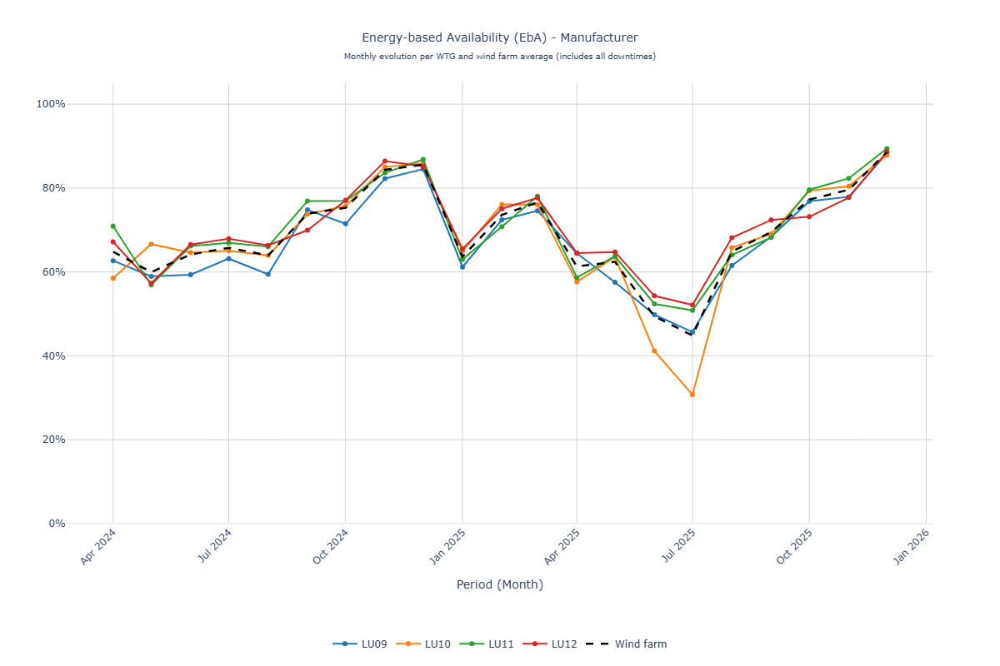
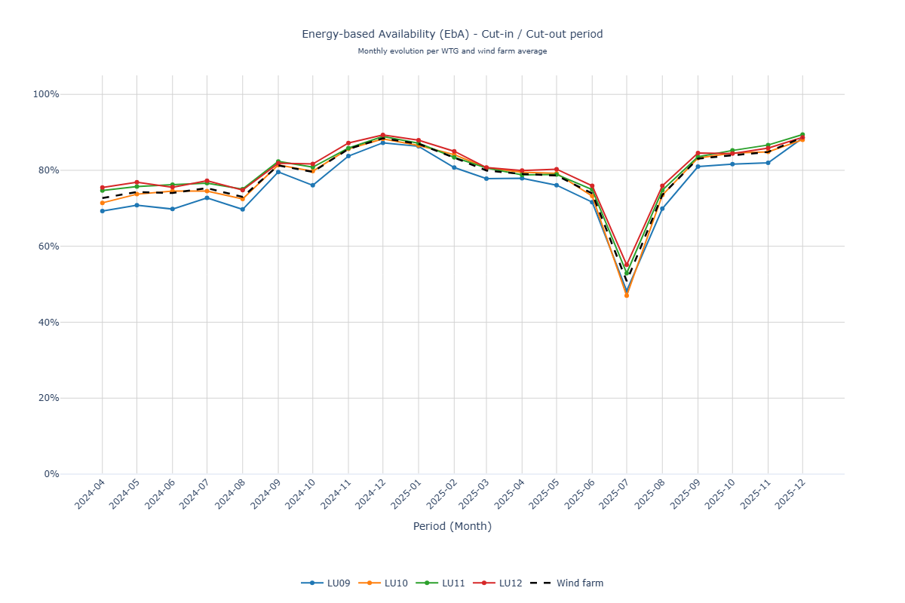
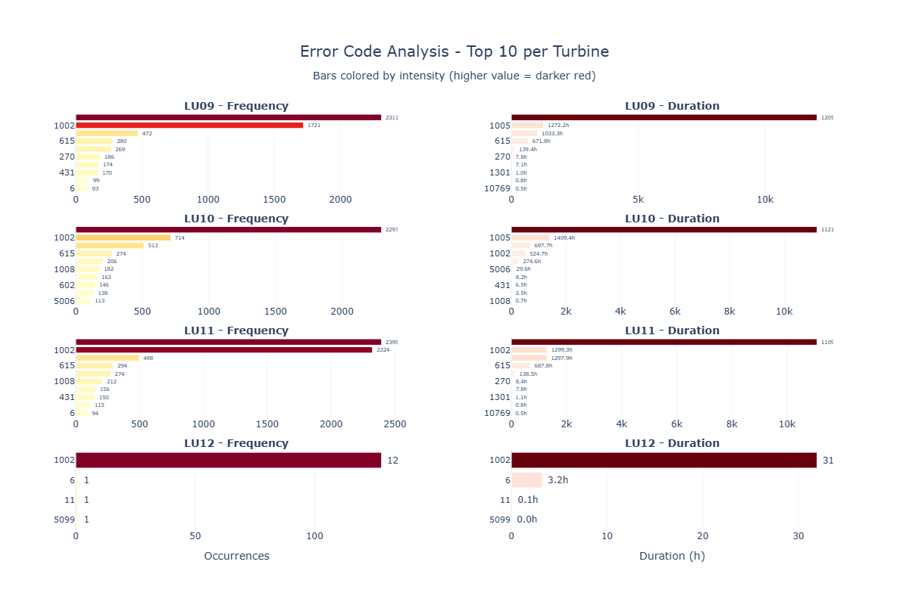
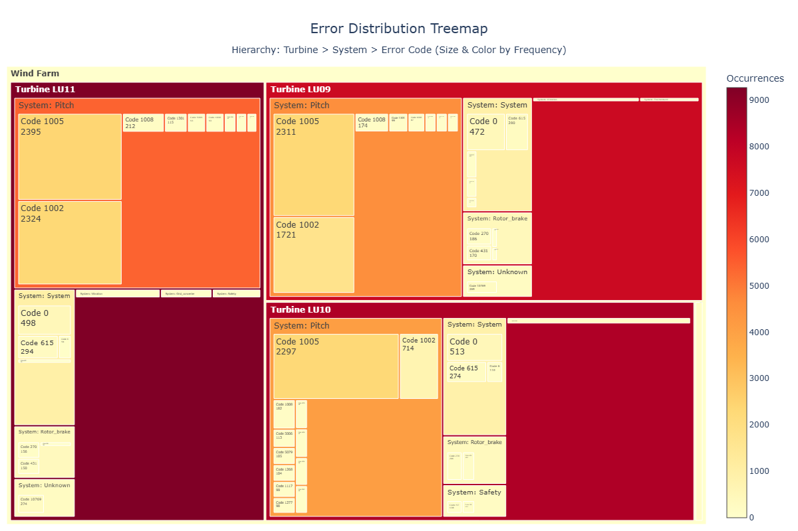

# Wind Turbine Analytics 🌬️

**Système d'analyse de performance SCADA pour parcs éoliens**

Génère automatiquement des rapports Word professionnels à partir de données SCADA et logs d'alarme pour l'analyse continue de performance opérationnelle.

---

## 🎯 Analyse SCADA - Performance Continue

Analyse approfondie des performances opérationnelles sur périodes étendues :

- 📊 **EBA (Energy-Based Availability)** : Disponibilité énergétique mensuelle selon IEC 61400-26
- 📈 **Courbes de puissance** : Comparaison avec la courbe garantie du constructeur
- 🌡️ **Analyse environnementale** : Rose des vents, distribution de vitesse, corrélations météo
- ⚠️ **Analyse des codes d'erreur** : Criticité, fréquence, durée d'impact, top erreurs récurrentes
- 📉 **Pertes de production** : Identification des sources de perte et quantification énergétique

**Livrables** : Rapports d'analyse de disponibilité, pertes de production, visualisations interactives, recommandations d'optimisation.

---

## 📊 Visualisations Générées

### Rose des Vents


Distribution directionnelle des vents avec bins de vitesse (0-3, 3-5, 5-10, 10-15+ m/s).

### Courbe de Puissance


Relation vitesse du vent vs puissance active avec seuils de validation.

### EBA Mensuelle - Constructeur


Disponibilité énergétique mensuelle par turbine avec codes couleur de performance.

### Pertes d'Énergie Mensuelles


Histogramme des pertes d'énergie par turbine avec gradient de criticité (bleu → rouge).

### Top Codes d'Erreur


Top 10 des codes par fréquence et durée avec criticité colorée (CRITICAL, HIGH, MEDIUM, LOW).

### Répartition des Erreurs (Treemap)


Arborescence hiérarchique des codes d'erreur par système fonctionnel et criticité.

---

## 🚀 Démarrage Rapide

### Installation
```bash
pip install -r requirements.txt
```

### Lancer une Analyse SCADA
```bash
python scada_main.py ./experiments/scada_analyse
```

### Configuration
Fichiers YAML dans `experiments/*/config.yml` définissent :
- Chemins des données (CSV SCADA + logs d'alarme)
- Période d'analyse (date_range: start/end)
- Critères de performance (seuils EBA, puissance nominale)
- Mapping des colonnes (adapté au format constructeur)
- Template Word et destination du rapport généré

---

## 📁 Structure

```
WindAnalysis/
├── src/wind_turbine_analytics/
│   ├── application/          # Workflows & configuration
│   ├── data_processing/      # Analyseurs & visualiseurs
│   └── presentation/         # Générateurs de rapports Word
├── experiments/              # Configurations & données de test
├── assets/templates/         # Templates Word
├── output/                   # Rapports générés
└── docs/                     # Visuels de documentation
```

---

## 🛠️ Technologies

- **Python 3.10+** : Langage principal
- **Pandas** : Traitement des séries temporelles SCADA
- **Plotly & Seaborn** : Visualisations interactives
- **python-docx** : Génération de rapports Word
- **pytest** : Tests unitaires

---

## 📖 Documentation Complémentaire

- [Visualiseur EBA](./docs/EBA_VISUALIZER.md) : Guide complet des visualisations de disponibilité énergétique
- [CLAUDE.md](./CLAUDE.md) : Architecture technique et conventions de développement

---

**Développé pour l'analyse de performance de parcs éoliens Nordex, Vestas, Siemens Gamesa.**
